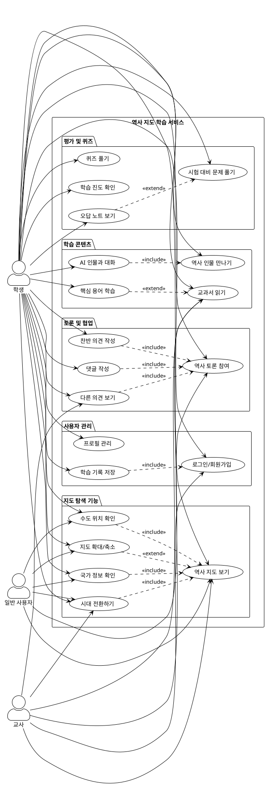

# 역사 지도 학습 서비스 - Use Case Diagram

## PlantUML 코드



---

## Mermaid 다이어그램 (GitHub 호환)

```mermaid
graph TB
    subgraph Actors
        Student[👨‍🎓 학생]
        Teacher[👨‍🏫 교사]
        User[👤 일반 사용자]
    end

    subgraph "지도 탐색 기능"
        UC1[역사 지도 보기]
        UC2[시대 전환하기]
        UC3[국가 정보 확인]
        UC4[수도 위치 확인]
        UC5[지도 확대/축소]
    end

    subgraph "학습 콘텐츠"
        UC6[📚 교과서 읽기]
        UC7[👥 역사 인물 만나기]
        UC8[💬 AI 인물과 대화]
        UC9[📝 핵심 용어 학습]
    end

    subgraph "평가 및 퀴즈"
        UC10[퀴즈 풀기]
        UC11[시험 대비 문제]
        UC12[학습 진도 확인]
        UC13[오답 노트]
    end

    subgraph "토론 및 협업"
        UC14[💬 역사 토론 참여]
        UC15[찬반 의견 작성]
        UC16[다른 의견 보기]
        UC17[댓글 작성]
    end

    subgraph "사용자 관리"
        UC18[로그인/회원가입]
        UC19[프로필 관리]
        UC20[학습 기록 저장]
    end

    %% 학생 연결
    Student --> UC1
    Student --> UC2
    Student --> UC3
    Student --> UC6
    Student --> UC7
    Student --> UC8
    Student --> UC10
    Student --> UC11
    Student --> UC14
    Student --> UC18

    %% 교사 연결
    Teacher --> UC1
    Teacher --> UC6
    Teacher --> UC14
    Teacher --> UC18

    %% 일반 사용자 연결
    User --> UC1
    User --> UC2
    User --> UC3
    User --> UC6

    %% Include 관계
    UC2 -.->|include| UC1
    UC3 -.->|include| UC1
    UC8 -.->|include| UC7
    UC15 -.->|include| UC14

    %% Extend 관계
    UC5 -.->|extend| UC1
    UC9 -.->|extend| UC6
```



---

## 텍스트 기반 다이어그램

```
                    역사 지도 학습 서비스
┌─────────────────────────────────────────────────────────────┐
│                                                                 │
│  👨‍🎓 학생                                                       │
│    ├── 🗺️  역사 지도 보기                                      │
│    │    ├── 시대 전환하기 (BC 2000 ~ 현재)                     │
│    │    ├── 국가 정보 확인 (클릭/호버)                         │
│    │    ├── 수도 위치 확인                                      │
│    │    └── 지도 확대/축소/이동                                │
│    │                                                            │
│    ├── 📚 학습 콘텐츠                                          │
│    │    ├── 교과서 읽기                                        │
│    │    ├── 역사 인물 만나기                                   │
│    │    ├── AI 인물과 대화                                     │
│    │    └── 핵심 용어 학습                                     │
│    │                                                            │
│    ├── 📝 평가 및 퀴즈                                         │
│    │    ├── 퀴즈 풀기                                          │
│    │    ├── 시험 대비 문제 풀기                               │
│    │    ├── 학습 진도 확인                                     │
│    │    └── 오답 노트 보기                                     │
│    │                                                            │
│    ├── 💬 토론 및 협업                                         │
│    │    ├── 역사 토론 참여                                     │
│    │    ├── 찬반 의견 작성                                     │
│    │    ├── 다른 의견 보기                                     │
│    │    └── 댓글 작성                                          │
│    │                                                            │
│    └── 👤 사용자 관리                                          │
│         ├── 로그인/회원가입                                    │
│         ├── 프로필 관리                                        │
│         └── 학습 기록 저장                                     │
│                                                                 │
│  👨‍🏫 교사                                                       │
│    ├── 🗺️  역사 지도 보기 (참고 자료)                         │
│    ├── 📚 교과서 열람                                          │
│    └── 💬 학생 토론 모니터링                                   │
│                                                                 │
│  👤 일반 사용자                                                 │
│    ├── 🗺️  역사 지도 탐색                                      │
│    └── 📚 교과서 읽기 (공개 콘텐츠)                            │
│                                                                 │
└─────────────────────────────────────────────────────────────┘
```

---

## 주요 Use Case 설명

### 1. 핵심 기능 (Core)
| Use Case | 설명 | 우선순위 |
|----------|------|----------|
| **역사 지도 보기** | 시대별 동아시아 지도 표시 | ⭐⭐⭐⭐⭐ |
| **시대 전환하기** | 타임라인 슬라이더로 BC 2000 ~ 현재 이동 | ⭐⭐⭐⭐⭐ |
| **국가 정보 확인** | 클릭/호버로 국가명, 연도 표시 | ⭐⭐⭐⭐ |
| **수도 위치 확인** | 시대별 수도 마커 표시 | ⭐⭐⭐⭐ |

### 2. 학습 기능 (Educational)
| Use Case | 설명 | 우선순위 |
|----------|------|----------|
| **교과서 읽기** | 시대별 교과서 콘텐츠 (사이드 패널) | ⭐⭐⭐⭐ |
| **AI 인물과 대화** | 역사 인물 AI 챗봇 | ⭐⭐⭐ |
| **퀴즈 풀기** | 지도 기반 인터랙티브 퀴즈 | ⭐⭐⭐⭐ |
| **핵심 용어 학습** | 용어 하이라이트 및 설명 | ⭐⭐⭐ |

### 3. 소셜 기능 (Social)
| Use Case | 설명 | 우선순위 |
|----------|------|----------|
| **역사 토론 참여** | 역사적 주제로 토론 (찬반) | ⭐⭐⭐ |
| **의견 작성** | 자신의 견해 작성 | ⭐⭐⭐ |
| **댓글 작성** | 다른 사용자 의견에 답변 | ⭐⭐ |

### 4. 관리 기능 (Management)
| Use Case | 설명 | 우선순위 |
|----------|------|----------|
| **로그인/회원가입** | 사용자 인증 | ⭐⭐⭐⭐ |
| **학습 기록 저장** | 진도, 퀴즈 점수 저장 | ⭐⭐⭐ |
| **학습 진도 확인** | 대시보드 | ⭐⭐ |

---

## 시나리오 예시

### 시나리오 1: 학생의 삼국시대 학습
```
1. 학생이 로그인
2. 메인 지도 화면에서 타임라인을 475년으로 이동
3. 고구려, 백제, 신라 영역 확인
4. 백제 영역 클릭 → 국가 정보 팝업 확인
5. 📚 교과서 버튼 클릭 → 사이드 패널에서 "삼국의 성립과 발전" 읽기
6. 👥 인물 버튼 클릭 → 장수왕 선택 → AI 대화 시작
7. 📝 퀴즈 버튼 클릭 → "백제의 수도는?" 문제 풀기
8. 학습 기록 자동 저장
```

### 시나리오 2: 교사의 수업 준비
```
1. 교사가 로그인
2. 메인 지도에서 고려시대(1000년) 이동
3. 📚 교과서 패널 열어 "고려의 건국" 내용 확인
4. 💬 토론 패널에서 학생들의 "고려의 북진 정책" 토론 모니터링
5. 주요 의견에 댓글 작성
```

---

## 다이어그램 사용 방법

### PlantUML 렌더링
1. https://www.plantuml.com/plantuml/uml/ 접속
2. 위 코드 붙여넣기
3. PNG/SVG로 다운로드

### Mermaid 렌더링
- GitHub README.md에 직접 붙여넣으면 자동 렌더링
- https://mermaid.live/ 에서도 확인 가능

### 이미지로 저장하고 싶다면
- PlantUML: VSCode 확장 설치 후 `.puml` 파일로 저장
- Mermaid: Mermaid Live Editor에서 Export
